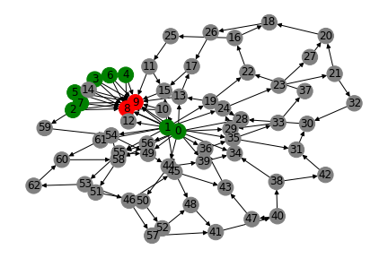
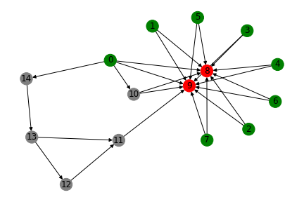
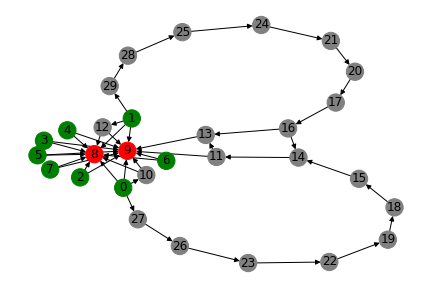
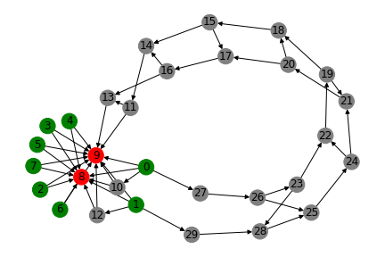

# Distributed Embryogenesis of Neural Topologies

Project last updated 2021/06/21, README last updated September 2024

## Introduction

This project generates neural network architectures through a cell-based, bottom-up approach. Instructions are given to individual neurons on how to connect to each other and produce new neurons. Starting from a minimal network structure, more complicated topologies emerge through the distributed, spontaneous developments of individual neurons. The cell-based instructions are gradually optimized through evolutionary algorithm.

To try it yourself, run __Evolution.py__

Dataset.py generates a toy dataset which imitates visual stimulations to two retinas (see discussion on "modularity" below).

## Examples

The neural networks start with basic structures connection input nodes (green) to output nodes (red).
After a few generations, some networks learn to develop hidden layers by connection useful inputs to a couple of intermediary neurons, as shown below. 

The topology of hidden layers are further developed as evolution continues. We begin to see symmetry/modularity when such topologies are beneficial to the task at hand. In our case, the toy dataset simulates binocular vision, and consequently two copies of a similar structures seem to have emerged. 

Finally, a complicated web of neurons developed, showcasing that the algorithm is able to develop advanced modularized neural structures to fit the data.

__To see more example topologies generated by this project, go to the "evolved_topologies" directory.__

## Motivation

There is abundant research on automatic generation of more efficient neural network architectures. One fundamental question for those attempts is how neural architecture should be represented in code.

NAS methods such as NEAT (Neural Evolution of Augmenting Topologies) adopt the "blueprint" approach, in which the object to be optimized is an explicit statement of the nodes and connections in a neural topology.

One notable shortcomings of such approaches is __modularity__. When a successful local topology is produced, it is unclear how we can replicate that local success to other parts where it would also be helpful, without explicitly coding replication of modules.
I take inspiration from the mechanisms behind biological modularity. The human body (and its brain) is created not through a top-down approach, but a bottom-up one. In an embryogenic state (and also after birth), cells interact, change, and split (create new cells) in a localized/distributed manner according to instructions given by genes, and macro structures emerge therefrom.

## Implementation

This project is an attempt to make use of that biological inspiration. In this project, every neural network goes through an embryogenic state where the topology is grown iteratively. Each neuron takes up a place in a two-dimensional space. They look for nearby neurons with certain attributes to establish neural connections. Those attributes include the neuron's in and out degrees (number of i/o neurons connected to it), its path of historical development in embryogeny, and its distance from the target neuron. If two neurons already have a connection weight in between them, they would also consider spawning a new neuron half-way on that connection. These two basic operations (addConnection and InsertNode) are inspired by NEAT, and should theoretically allow the construction of any feedforward neural network architecture.

(More detailed descriptions to come)

See __log.txt__ for historical developments on the project, concerns, and possible paths for future improvement.
