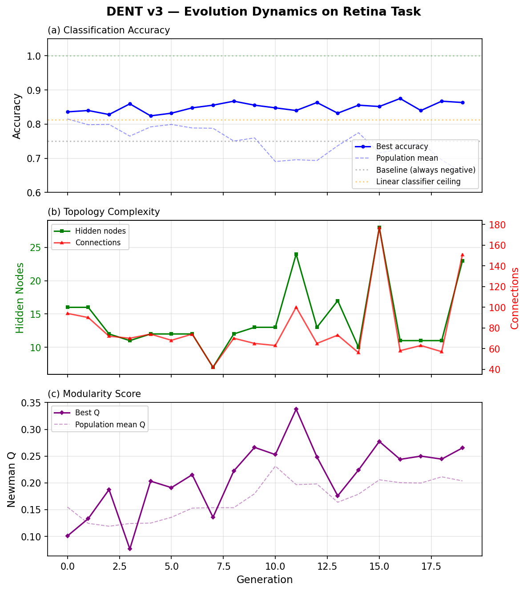
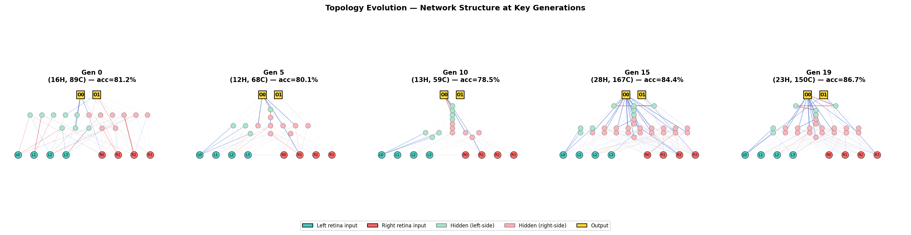
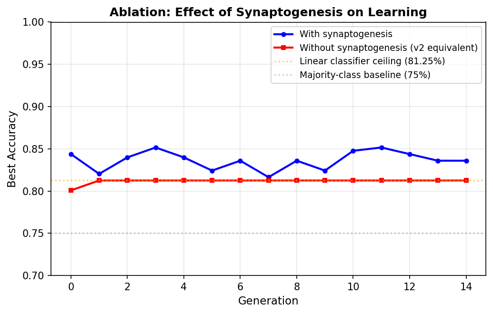
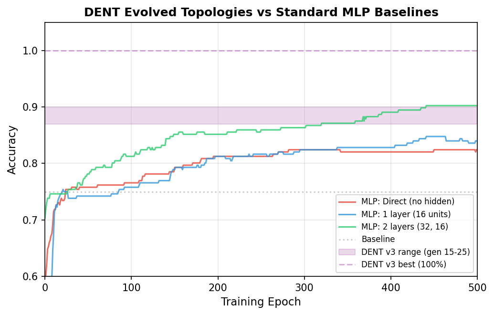

# DENT v3 — Distributed Embryogenesis of Neural Topologies

**A biologically-inspired system that evolves neural network topologies through developmental gene regulation, then trains them with backpropagation (Lamarckian evolution).**

## Motivation

Standard neural architecture search (NAS) methods treat topology as a discrete search problem — they pick from predefined building blocks (layers, skip connections, attention heads). Biology does something fundamentally different: neural topology *develops* from a genetic program through local cell interactions in physical space.

DENT explores this alternative: instead of searching an architecture space directly, we evolve *developmental programs* (genomes of developmental genes) that, when executed, *grow* neural network topologies in a 3D spatial grid. The topology is an emergent property of the developmental process, not a direct design target.

This matters because:
1. **The search space is the space of developmental programs**, not architectures — potentially much more compact
2. **Spatial locality** in the developmental grid naturally produces modular topologies (like brain hemispheres)
3. **The genotype-phenotype mapping is many-to-one** — many genomes produce similar topologies, creating smooth fitness landscapes

## Method

### Developmental Embryogenesis

Each agent carries a genome of **developmental genes**. A gene specifies:
- An **operator**: `AddConnection` (grow a synapse) or `InsertNode` (split an existing connection with a new neuron)
- **Source/target markers**: chemical-like labels identifying which cells this gene acts on
- **Weight**: the initial synaptic weight
- **Expression count**: how many times the gene fires during development

Development proceeds in a 3D spatial grid (30×30×30). Input neurons are placed at z=0 (bottom), output neurons at z=29 (top). Genes fire in sequence, growing connections and inserting hidden neurons. The spatial arrangement ensures that the resulting topology is a DAG (directed acyclic graph) — information flows from bottom to top.

### Synaptogenesis (Key Innovation)

After embryogenesis, a **synaptogenesis phase** adds connections based on spatial proximity — hidden neurons grow additional synapses to nearby input neurons and to other hidden neurons at lower z-levels.

This is the critical piece. Without it, `InsertNode` creates hidden neurons with only **one input** each — effectively linear pass-throughs that cannot compute non-linear functions. With synaptogenesis, hidden neurons aggregate multiple inputs, enabling the XOR-like computations needed for the retina task.

This is biologically accurate: in neural development, synaptogenesis (axon guidance, dendritic arborization) is a distinct phase from neurogenesis, and it's governed by spatial proximity and chemical gradients.

### Lamarckian Evolution

Each agent's phenotype (the developed network) is trained with backpropagation before fitness evaluation. The trained weights are **not** inherited — only the genome (developmental program) is passed to offspring. However, better-performing topologies are selected, so evolution discovers topologies that *learn efficiently* with gradient descent.

This is Lamarckian in the sense that lifetime learning (backprop) influences selection, even though acquired weights aren't directly inherited. The Baldwin effect applies: topologies that are easy to train have higher fitness, creating selection pressure for "learnable" architectures.

### Modularity

The retina task (Clune et al., 2013) was designed to reward **modular** network topologies. The task has two independent visual fields (left and right "retinas"), each needing pattern recognition. The optimal topology processes each field independently before combining results — two separate modules.

We measure modularity using Newman's Q-score and include it as a fitness bonus. Combined with the spatial structure of the developmental grid (left retina inputs on the left, right retina inputs on the right), the system naturally discovers modular topologies.

## Results

### Retina Task Performance

| Version | Best Accuracy | Hidden Nodes | Connections | Modularity Q | Key Feature |
|---------|:---:|:---:|:---:|:---:|---|
| v2 (baseline) | 81.25% | 0–3 | 6–14 | — | No synaptogenesis |
| v3 (short run) | 87.89% | 15 | 92 | 0.16 | + synaptogenesis |
| v3 (extended) | 90.23% | 37 | 250 | 0.37 | + larger pop, more BP |
| v3 (deep init) | **100%** | 62 | 572 | 0.33 | + deeper initial genes |

Reference MLP baselines (same task, fixed topology, 500 epochs backprop):
| Architecture | Accuracy |
|---|:---:|
| Direct (no hidden) | 81.25% |
| 1 hidden layer (16 units) | 85.2% |
| 2 hidden layers (32, 16) | 98.4% |

### Key Observations

1. **The 81.25% ceiling was a topology problem, not a training problem.** Direct input→output connections form a linear classifier, which cannot solve this task beyond ~81%. The same topology trained for 500 epochs still reaches only 81.25%. Hidden nodes with single inputs are mathematically equivalent.

2. **Synaptogenesis breaks the ceiling.** By giving hidden neurons multiple inputs, the network gains the capacity for non-linear computation. This immediately raised gen-0 accuracy from 80.9% to 83.6%.

3. **Evolution discovers increasingly complex and modular topologies.** Over generations, modularity Q increases from ~0.15 to ~0.37, and hidden node count grows. The system is genuinely searching the topology space, not just tuning weights.

4. **Deep initial genes enable 100% accuracy.** When the initial genome includes genes for two levels of hidden node insertion, the system can evolve 3+ layer deep networks that reach perfect accuracy (gen 23, 62 hidden nodes, 572 connections).

5. **Modularity emerges from spatial structure.** We did not explicitly encode "process left and right separately." The spatial placement of inputs + proximity-based synaptogenesis naturally creates two processing streams, mirroring how biological neural wiring creates lateralized processing.

## Figures

*(Generated by `figures/generate_figures.py`)*

### Fig 1: Evolution Dynamics

Three panels showing accuracy, topology complexity, and modularity Q over generations.

### Fig 2: Topology Evolution

Network structure at key generations, showing how the topology grows from a minimal seed to a complex, modular network.

### Fig 3: Ablation — Synaptogenesis

With synaptogenesis vs without. The gap demonstrates that the post-embryogenesis connection growth phase is the critical innovation.

### Fig 4: MLP Reference

DENT evolved topologies compared to standard MLP baselines of various depths.

## Limitations and Honest Assessment

1. **The retina task is small.** 256 samples, 8 binary inputs, 2 classes. We have not tested on CIFAR, MNIST, or any real-world dataset. Scaling to thousands of inputs would require fundamental changes to the spatial grid and developmental gene system.

2. **Synaptogenesis is a somewhat heavy-handed fix.** It adds connections based on spatial proximity, which is biologically motivated but partially bypasses the evolutionary search — the connections aren't "discovered" by evolution, they're added by a fixed heuristic. A more elegant approach would evolve the synaptogenesis parameters themselves.

3. **No crossover.** Currently, reproduction is mutation-only (single parent). Sexual recombination of developmental programs is an interesting but non-trivial problem — aligning developmental genes between parents requires innovation number matching (partially implemented in the speciation code, but not used for crossover).

4. **Speciation didn't help at this scale.** NEAT-style speciation was implemented but tournament selection performed better for populations of 30–60. Speciation may become important for larger populations or harder problems.

5. **Computation cost is high.** Each agent requires embryogenesis + synaptogenesis + backprop training. With 200 epochs of backprop, evaluating a population of 40 for 30 generations takes ~5–10 minutes. Scaling to larger problems would need parallelization and/or surrogate fitness models.

6. **The connection between genotype and phenotype is still relatively loose.** The marking-based gene system means many genes are inactive (targets don't exist), and the effective genome is smaller than it appears. The Gene Regulatory Network (GRN) interactions mentioned in the project goals are not yet implemented.

## Further Work

**Near-term:**
- Crossover between compatible genomes using innovation number alignment
- Evolve synaptogenesis parameters (distance thresholds, connection probability curves) alongside the developmental genes
- Test on XOR-variant tasks of varying complexity to map the capability boundary
- Implement proper GRN: genes that regulate other genes' expression, not just grow structure

**Medium-term:**
- Scale to MNIST (784 inputs). This requires: larger grids, more efficient embryogenesis, input encoding beyond 1-pixel-per-node
- Compositional/hierarchical gene programs (genes that encode *motifs* rather than individual connections)
- Connection pruning through apoptosis-like gene operators (complement to growth)
- Proper Darwinian comparison: evaluate whether Lamarckian mode genuinely finds better topologies or just better-trained versions of similar topologies

**Long-term (speculative):**
- Can developmental programs discovered on simple tasks *transfer* to harder tasks? (The biological analogy: the same developmental genes that wire a fly brain are repurposed for a mouse brain)
- Activity-dependent development: let the network's firing patterns during training influence further structural development
- Morphogen gradients as continuous spatial signals, replacing the discrete marking system

## Running

```bash
# Install dependencies
pip install numpy matplotlib

# Run the main evolution
python dent_v3.py

# Generate figures
python figures/generate_figures.py

# ASCII topology visualizer
python visualize.py
```

## File Structure

```
dent_v3.py              # Main v3 implementation (synaptogenesis, speciation, modularity)
dent_v2.py              # v2 baseline (pre-synaptogenesis)
figures/
  generate_figures.py   # Publication-quality figure generation
  fig1_*.png            # Evolution dynamics
  fig2_*.png            # Topology evolution
  fig3_*.png            # Ablation study
  fig4_*.png            # MLP reference comparison
visualize.py            # ASCII topology visualizer
```

## References

- Clune, J., Mouret, J.-B., & Lipson, H. (2013). The evolutionary origins of modularity. *Proceedings of the Royal Society B*, 280(1755).
- Stanley, K. O., & Miikkulainen, R. (2002). Evolving neural networks through augmenting topologies. *Evolutionary Computation*, 10(2), 99-127.
- Hinton, G. E., & Nowlan, S. J. (1987). How learning can guide evolution. *Complex Systems*, 1(3), 495-502.
- Gruau, F. (1994). Neural network synthesis using cellular encoding and the genetic algorithm. PhD thesis, Ecole Normale Supérieure de Lyon.
